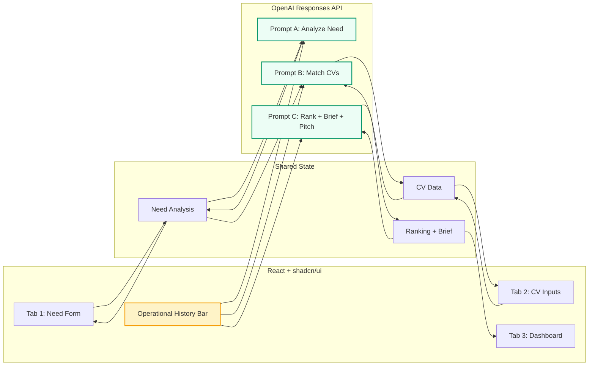

<p align="center">
  
</p>

<h1 align="center">⚡ TalentSift</h1>

<p align="center">
  <b>AI recruiter copilot for TDU</b><br>
  <i>Paste a JD → ranked candidates + client-ready brief + pitch script in under 60 seconds.</i>
</p>

<p align="center">
  <a href="#why-judges-care">🎯 Why Judges Care</a> ·
  <a href="#what-it-is">⚙️ What It Is</a> ·
  <a href="#architecture">🏛️ Architecture</a> ·
  <a href="#how-it-works">🧠 How It Works</a> ·
  <a href="#tech-stack">🛠️ Stack</a> ·
  <a href="#quick-start">🚀 Quick Start</a> ·
  <a href="#demo-script">🎬 Demo</a>
</p>

<br>

<!-- STACK BADGES — versions verified against package.json -->
<p align="center">
  
  
  
  
  
  
  
</p>

<p align="center">
  
  
</p>

---

> **⚡ JD → Ranked Candidates + Client Brief + Pitch Script in ≤60 seconds.**  
> No backend. No database. No auth. Just a browser + API key.
>
> 🎯 3 specialized AI prompts (not a chatbot) · ⭐ Operational history differentiator  
> 💻 React 19 · TypeScript 5 · Vite 7 · Tailwind 4 · shadcn/ui · OpenAI Responses API

---

## 🎯 Why Judges Care

Every feature lands on at least one TDU scoring criterion:

| Score bucket | ~Wt | How TalentSift delivers |
|-------------|-----|------------------------|
| **AI pertinence** | 7pt | 3 specialized prompts (no chatbot) — structured JSON, evidence-based strengths/risks, explicit "why this CV". Op history proves AI *listens* without over-prioritizing. |
| **Feature completeness** | 5pt | 4 features + op history bonus — end-to-end: need analysis → matching → ranking → brief/pitch in a single session. |
| **UX fluidity** | 4pt | Loading skeletons, error fallbacks, empty states, retry on every action. 3-tab layout + shared op history bar visible on every screen. |
| **Demo quality** | 4pt | 2-min script with one "wow" moment: edit op history → rerun → rankings shift while non-fit CVs stay correctly low. Trust signal in 30s. |

> **The 120-second story:** A recruiter goes from blank form → client-ready brief + recruiter pitch. The AI respects manager bias but *refuses* to inflate a bad match. That's what separates a copilot from a chatbot.

---

## ⚙️ What It Is

A browser-based AI copilot. One session, four actions:

| # | Action | What you get | ~Clicks |
|---|--------|-------------|---------|
| **1** | 📋 **Analyze Need** | Structured 5-line summary, must-have/nice-to-have skills, watch points, ideal profile | 3 |
| **2** | 👤 **Match CVs** | Per-candidate score (Fort/Moyen/Faible), recommendation, strengths/weaknesses, call questions | 3 |
| **3** | 📊 **Rank & Compare** | Ranked best-fit, backup & lower-priority with rationale | Auto |
| **4** | 📝 **Brief & Pitch** | TDU-format client brief + recruiter pitch script — copy-ready | 1 |
| **⭐** | **Op History** | Free-text manager preferences — AI *must* use for ranking, *cannot* override genuine role fit | Always on |

**Zero backend.** Just `pnpm install` + one API key. Max reliability for live demo.

---

## 🏛️ Architecture



**Layout:** 3 tabs + always-visible Operational History Bar.  
**Data flow:** Shared React state feeds structured inputs → 3 specialized prompts → UI updates.

---

## 🧠 How It Works

### 3 Specialized AI Prompts (No Chatbot)

Every action sends structured data + op history to the OpenAI Responses API. Each prompt has a precise JSON schema with recruiter-tone guardrails.

**Prompt A — Analyze Need**  
`JD + constraints + op history` → summary, mustHaveSkills[], niceToHaveSkills[], watchPoints[], idealProfile

**Prompt B — Match 3 CVs**  
`Analyzed need + op history + 3 CV texts` → per-candidate: matchScore (Fort/Moyen/Faible), numericScore (0–100), recommendation, strengths[], watchPoints[], callQuestions[]

**Prompt C — Rank + Brief + Pitch**  
`Need analysis + all matches + op history` → ranking[] with rationale, clientBrief (TDU format), pitchScript

### ⭐ Operational History

A free-text field persisted across all tabs that remembers manager preferences:

- ✅ **Influences** prioritization and alerts in every prompt
- ❌ **Does not** inflate impossible matches (a PO CV stays weak for a Java/Kafka role)
- 🎬 **Creates the demo wow moment**: edit it → rerun → watch rank movement while non-fit stays low

---

## 🛠️ Tech Stack

| Layer | Tools | Why |
|-------|-------|-----|
| **UI** | React 19, TypeScript 5 | Modern, typed, fast iteration |
| **Build** | Vite 7 | Near-instant HMR, small prod bundles |
| **Styling** | Tailwind CSS 4, shadcn/ui, Lucide icons | Clean, consistent, zero CSS debt |
| **AI** | OpenAI Responses API (`gpt-5.4-mini`) | Speed + structured JSON output for live demo |
| **Tooling** | Biome 2 (lint + format) | Single tool, no config wars |

**No backend. No database. No auth.** Just a browser and an API key.

---

## 🚀 Quick Start

```bash
# 1. Install
pnpm install

# 2. Configure
cp .env.example .env
# Edit .env → set VITE_OPENAI_API_KEY=sk-...

# 3. Run in mock mode (zero API calls — ideal for demo)
VITE_MOCK_MODE=1 pnpm dev

# 4. Open
open http://localhost:5173
```

### Environment Variables

```bash
VITE_OPENAI_API_KEY=sk-...          # OpenAI API key
VITE_OPENAI_MODEL=gpt-5.4-mini       # Model override (optional)
VITE_MOCK_MODE=1                      # 1 = mock responses, no API call
```

---

## 🎬 Demo Script

| Time | Tab | Action | Soundbite |
|------|-----|--------|-----------|
| 0:00 | Need | **Analyze Need** | "5-line summary, must-have skills, watch points — op history already at work." |
| 0:20 | CVs | **Run Matching** | "CV1 (Kafka) strong, CV3 (Data) medium, CV2 (PO) weak. Trust signal: can reject non-fit." |
| 0:55 | CVs | **Edit op history → Rerun** | "Bias influences but doesn't override role fit." |
| 1:20 | Dashboard | **Show ranking, brief, pitch** | Copy buttons → "Immediately recruiter-usable." |
| 1:45 | Close | Recap | "All 4 features + op history live. Outputs directly recruiter-usable." |

---

## 📁 Repository

```
src/
├── components/     UI (3 tabs, cards, forms)
├── hooks/          State management, API calls
├── lib/            Prompt templates, OpenAI client, utils
├── types/          Shared TypeScript types
└── App.tsx         Root layout with 3-tab navigation
```

### Test Data (Ships with the repo)

| CV | Profile | Best for |
|----|---------|----------|
| `CV_1_Kafka.pdf` | Kafka specialist | Java/Kafka JD |
| `CV_2_PO_E_commerce.pdf` | PO / IT project manager | PO E-Commerce JD |
| `CV_3_Data_Architect.pdf` | Data engineer / architect | Data Architect JD |

**Demo tip:** Use Java/Kafka JD with all 3 CVs → strong/medium/weak discrimination in one pass.

---

## 🚫 Anti-Scope

Per the TDU playbook, this sprint does **not** include:

❌ Auth · ❌ ATS integration (BoondManager) · ❌ Permissions · ❌ Email sending · ❌ PDF parsing (paste-only is sufficient)

---

## 🔮 Future Features

Planned post-hackathon upgrades (priority order):

- **PDF CV ingestion + parsing** with structured extraction and confidence scoring
- **Recruiter preference memory library** (per manager/team) with reusable presets
- **Explainable scoring panel** showing exact signal contributions per candidate
- **Resume integrity checks** (hidden text, metadata forensics, AI-generated CV signals)
- **Identity and timeline verification** via OSINT cross-checks
- **ATS + extension workflow** (BoondManager sync + Chrome-side recruiter assistant)

<details>
<summary>🔭 Future Roadmap</summary>

See [`.omo/FUTURE-ROADMAP.md`](.omo/FUTURE-ROADMAP.md) for the full post-hackathon vision across 4 phases:

| Phase | Theme | Highlights |
|-------|-------|------------|
| **1** | Core UX | PDF upload, persistent preference library, explainable scores, batch re-rank, language toggle |
| **2** | Integrity Layer | Hidden text detection, metadata forensics, AI-generated CV detection, GitHub cross-ref, keyword stuffing |
| **3** | Full Verification | Identity OSINT, timeline cross-check, company validation, sanctions screening, court records |
| **4** | Platform & Compliance | ATS integration, Chrome extension, AI audit trail, bias reports, candidate portal |

Presentations for each phase are in `.omo/` as `.pptx` files.

</details>

---

## Links

- [TDU Website](https://tdu.work/)
- [Hackathon Playbook](https://cloudy-breakfast-27b.notion.site/TDU-Ultimate-Builder-Night-Hacker-Playbook-341e105bfb5e803eaf42d45051b47f0e)
- [Luma Event](https://luma.com/3om3yovm)

---

<p align="center">
  <b>Built for the TDU Ultimate Builder Night — June 2026</b><br>
  <i>All 4 features + operational-history differentiator are live,<br>and outputs are directly usable by a recruiter.</i>
</p>

<p align="center">
  
  
</p>
